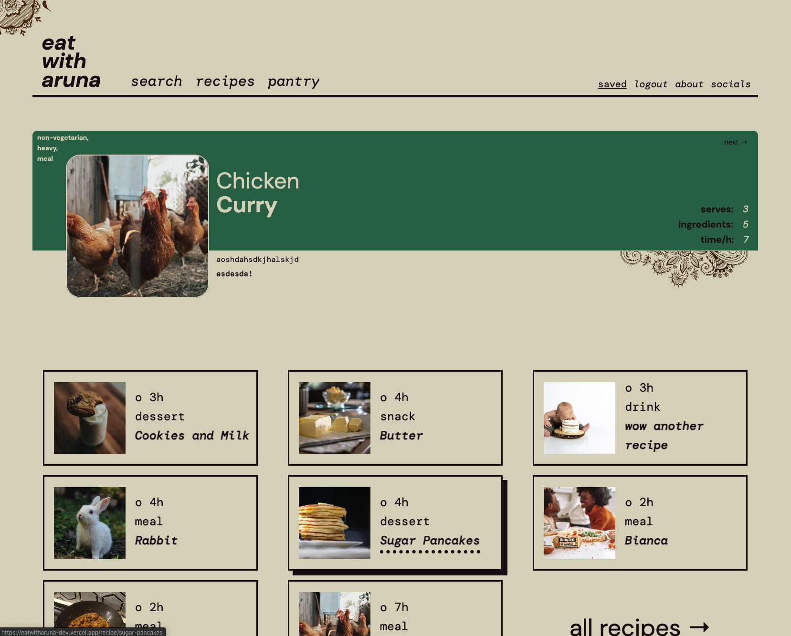
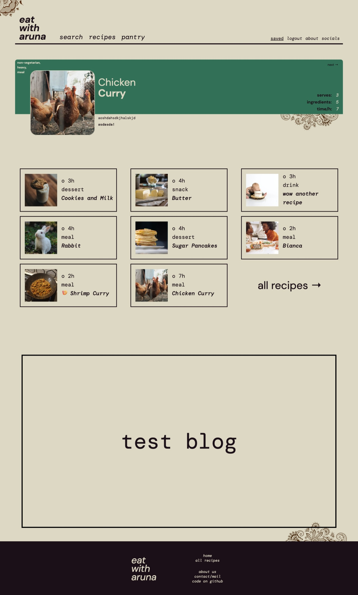
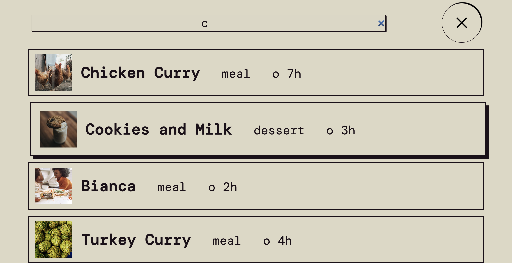
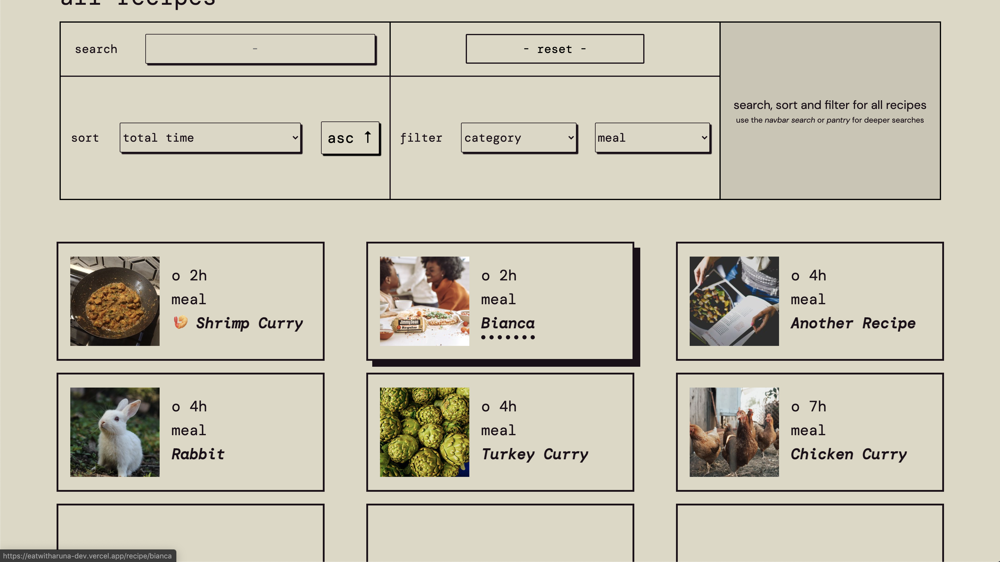
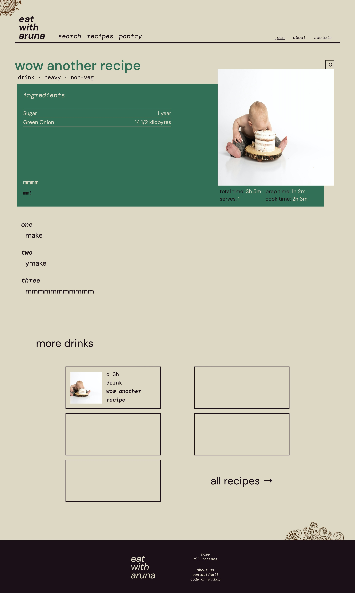
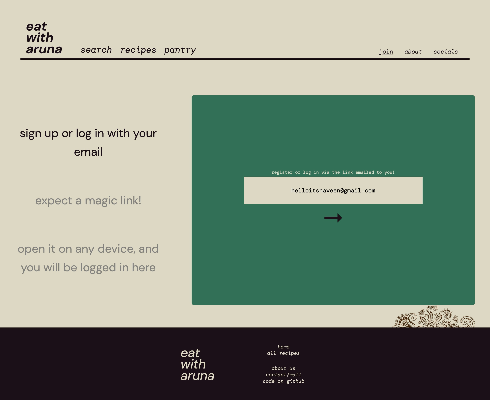
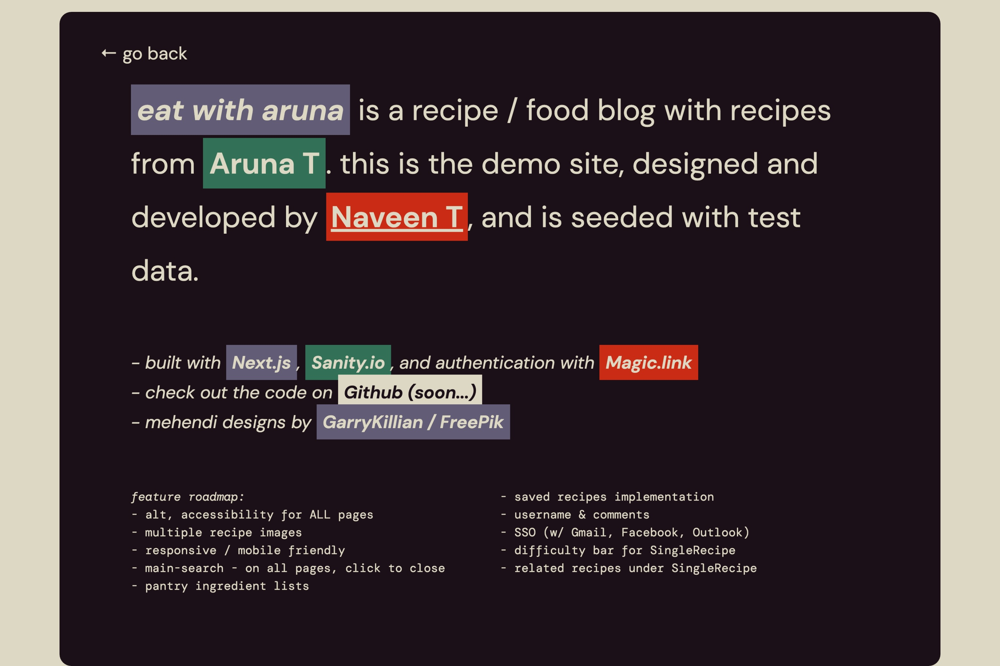

<h1 align='center'>- eat with aruna (dev) -</h1>
<!-- ### recipes, blogs and more from ___Aruna T___. -->

<div align="center">
    :plate_with_cutlery:
</div>
<div align="center">
    <a href="https://eatwitharuna-dev.vercel.app/" /> [current demo] </a>
</div>
<div align="center">
  <strong>a recipe blog, built with Next.js & Sanity.io. all sourced from <code>Aruna T.</code></strong>
</div>

<div align="center">
  <sub>Built with ❤︎ by
  <a href="https://www.linkedin.com/in/helloitsnaveen/"><code>Naveen T</code></a> 
</div>

<br />


## Table of Contents:
- [Features / Usage](#Features)
- [Technologies](#Technologies)
    - [Motivations](#Motivations)
    - [Stack](#Stack)
    - [Recipe Schema](#Schema)
- [Images](#Images)
- [Future](#Future)



<br />


---
## Features
### ___General___
- ___Navbar___, with search modal and links to the recipes, pantry, login, about and socials pages. Once logged in, allows user to access saved recipes, and logout.
- ___Footer___, with links to home, recipes, about, contact and GitHub repo pages.
- __Search__, launched from Navbar - opens modal with search input, with results rendered as individual search tiles. 

### ___Home Page___
- ___Featured Recipe Tile___, automatically rotates through 'featurable' recipes, with a 'Next' button to change manually. Includes [recipe info](#Schema) => main Image, summary & byline, three recipe tags(suitableForDiet, recipeHeft, recipeHealth), and prep info (recipeYield, numIngredients, totalTime)

- ___Featured Recipe Grid___, a recipe grid of only 'featurable' recipes, will be randomized. Includes totalTime, recipeCategory, title and a link to the recipes page.

- ___Blog___, upcoming - will feature a random blog.

### ___Recipes Page___
- ___Grid Form___, with search bar, sorting options, filter options and a form reset. Results of the form are rendered in the Recipe Grid below. Statically rendered, with a single all recipes fetch and sorting through the result. Information and links to Navbar search and pantry on right.
- ___Grid___, renders results of Form, default being all recipes. Extends based on number of recipes, with empty tiles rendered with border only. Each tile holds main Image, totalTime, recipeCategory and title.

### ___Single Recipe___
- ___Single Recipe Card___ holds all recipe data except the steps, with the title and three primary tags, tabulated ingredients, prep, cook & total time, recipeYield, summary & byline and a main image with recipe difficulty above. 
- *upcoming* - will be able to look at multiple images by scrolling, and difficulty will be rendered as a progress bar against a scale of 10.
- *upcoming* - will be able to change portions and have ingredient amounts change accordingly.
- ___Instructions___ all the steps are parsed and serialized from `Sanity.io` 's `Portable Text` format, with each being numbered and listed below the recipe card.
- *upcoming* - will automatically highlight all ingredient names in the instruction steps for ease of usage.

### ___Pantry___
- *upcoming* - allow users to build list of owned ingredients, and returns all matching recipes.

### ___Join___
- allows user to sign up / log in using a single email link. 
- live validation of email, and link on left. Magic modal is opened upon email submit, and user is rerendered to Home page (Magic link can be opened from any device).

### ___About___
- Basic site information, with future features roadmap

### ___Social___
- Social links - Email, Facebook, Twitter

---

## Technologies 

### ___Motivations___
When beginning the project, I had a few core motivations that dictated the tech stack, features and design. 
- Stylized and eye-catching design, but with a very obvious & linear layout for easy navigation.
- Simplified CMS for ease of access for my mom (Aruna T) to add and remove ingredients, recipes and blogs. No tech knowledge should be necessary to organize content on the page, with all logic abstracted and hidden. 
- Minimal data-fetching, ideally fully static pages for quick load times and seamless navigation. Not a very data-intensive website, minimize API calls. 

### ___Stack___
- ___[Next.js](next.js.org)___: Utilized SSR on all pages (except login, SSG for authentication API requests), for near instantaneous page loads. Index page and recipes make a single `getAllRecipes` Sanity API request in their `getStaticProps` methods, with all further data manipulation done client side. `_app.js` used for site-global navbar and footer, CSS Modules used for all page and component styling.
- ___Sanity.io___ used as headless CMS, with `Sanity Studio` used  to add ingredients, recipes and blogs. `Studio` is a fully customizable React app, with a very simple interface to manage data - adding content simply through forms. Schema for recipes and ingredients set up, with `GROQ` queries to fetch from Sanity API.
- ___[Magic.link](magic.link)___ for a simple, passwordless authentication cycle. Stores JWT Token for extended sessions.

### ___Schema___
`Sanity recipe schema`:

``` jsonc
export default {
	name: "recipe",
	type: "document",
	title: "Recipe",
	fields: [
		// recipe title
		{
			name: "title",
			type: "string",
			title: "Title",
		},

		// slug
		{
			name: "slug",
			title: "Slug",
			type: "slug",
			description: "Generate to get slug from title",
			options: {
				source: "title",
				maxLength: 150,
			},
		},

		// short, two-part recipe summary
		{
			name: "summary",
			type: "document",
			title: "Summary",
			description: "two part summary, with main sentence and a byline",
			fields: [
				{
					name: "summary_main",
					type: "text",
					title: "summary-main",
					description: "first, main line of summary",
				},
				{
					name: "summary_byline",
					type: "text",
					title: "summary-byline",
					description: "byline of summary",
				},
			],
		},

		// images
		{
			name: "images",
			title: "Images",
			type: "document",
			description: "Recipe images, necessary minimum of 2.",
			fields: [
				{
					name: "image_main",
					type: "image",
					title: "Main Image",
					description: "Square, Main image",
					options: {
						hotspot: true,
					},
					validation: (R) => R.required(),
				},
				{
					name: "image_2",
					type: "image",
					title: "Image 2",
					options: {
						hotspot: true,
					},
					validation: (R) => R.required(),
				},
				{
					name: "image_3",
					type: "image",
					title: "Image 3",
					options: {
						hotspot: true,
					},
				},
				{
					name: "image_4",
					type: "image",
					title: "Image 4",
					options: {
						hotspot: true,
					},
				},
				{
					name: "image_5",
					type: "image",
					title: "Image 5",
					options: {
						hotspot: true,
					},
				},
			],
		},

		// prepTime
		{
			name: "prepTime",
			type: "document",
			title: "Prep Time",
			fields: [
				{
					name: "prepHours",
					type: "number",
					title: "Hours / H",
					validation: (Rule) => Rule.required().integer().positive(),
				},
				{
					name: "prepMinutes",
					type: "number",
					title: "Minutes / M",
					validation: (Rule) =>
						Rule.required().integer().positive().lessThan(60),
				},
			],
		},

		// cookTime
		{
			name: "cookTime",
			type: "document",
			title: "Cook Time",
			fields: [
				{
					name: "cookHours",
					type: "number",
					title: "Hours / H",
					validation: (Rule) => Rule.required().integer().positive(),
				},
				{
					name: "cookMinutes",
					type: "number",
					title: "Minutes / M",
					validation: (Rule) =>
						Rule.required().integer().positive().lessThan(60),
				},
			],
		},

		// totalTime
		{
			name: "totalTime",
			type: "document",
			title: "Total Time",
			fields: [
				{
					name: "totalHours",
					type: "number",
					title: "Hours / H",
					validation: (Rule) => Rule.required().integer().positive(),
				},
				{
					name: "totalMinutes",
					type: "number",
					title: "Minutes / M",
					validation: (Rule) =>
						Rule.required().integer().positive().lessThan(60),
				},
			],
		},

		// recipeYield
		{
			name: "recipeYield",
			type: "number",
			title: "# Serves",
			validation: (R) => R.required().positive().precision(1),
		},

		// numIngredients
		{
			name: "numIngredients",
			title: "Number of Ingredients",
			type: "number",
			validation: (R) => R.required().positive().integer(),
			// set initial value with function counting below recipeIngredients?
		},

		// recipeIngredients
		{
			name: "recipeIngredients",
			title: "Ingredients",
			type: "array",
			of: [{ type: "ingredientField" }],
			options: { sortable: true },
		},

		// recipeInstructions
		{
			name: "recipeInstructions",
			title: "Instructions for Recipe",
			type: "richText",
			description: "Uses PortableText, step-by-step numbered instructions",
		},

		// recipeCategory
		{
			name: "recipeCategory",
			title: "Recipe Category",
			type: "array",
			of: [{ type: "string" }],
			options: {
				list: [
					{
						title: "Snack",
						value: "snack",
					},
					{
						title: "Meal",
						value: "meal",
					},
					{
						title: "Dessert",
						value: "dessert",
					},
					{
						title: "Drink",
						value: "drink",
					},
				],
			},
			validation: (R) => R.length(1),
		},

		// suitableForDiet
		{
			name: "suitableForDiet",
			title: "Suitable for _ diet:",
			type: "array",
			of: [{ type: "string" }],
			options: {
				list: [
					{
						title: "Vegetarian",
						value: "vegetarian",
					},
					{
						title: "Non-Vegetarian",
						value: "non-vegetarian",
					},
					{
						title: "Pescatarian",
						value: "pescatarian",
					},
					{
						title: "Halal",
						value: "halal",
					},
				],
			},
		},

		// recipeHeft
		{
			name: "recipeHeft",
			title: "Heaviness of recipe",
			type: "array",
			of: [{ type: "string" }],
			options: {
				list: [
					{
						title: "Heavy",
						value: "heavy",
					},
					{
						title: "Light",
						value: "light",
					},
				],
			},
			validation: (R) => R.length(1),
		},

		// recipeHealth
		{
			name: "recipeHealth",
			title: "Healthiness of recipe",
			type: "array",
			of: [{ type: "string" }],
			options: {
				list: [
					{
						title: "Healthy",
						value: "healthy",
					},
					{
						title: "Comfort",
						value: "comfort",
					},
				],
			},
			validation: (R) => R.length(1),
		},

		// recipeSpice
		{
			name: "recipeSpice",
			title: "Spice of recipe",
			type: "array",
			of: [{ type: "string" }],
			options: {
				list: [
					{
						title: "Spicy",
						value: "spicy",
					},
					{
						title: "Medium",
						value: "medium",
					},
					{
						title: "Mild",
						value: "mild",
					},
				],
			},
			validation: (R) => R.length(1),
		},

		// difficulty
		{
			name: "difficulty",
			title: "Difficulty",
			description: "between ONE to TEN",
			type: "number",
			validation: (R) => R.required().integer().greaterThan(0).lessThan(11),
		},

		// color paletter
		{
			name: "recipeColor",
			title: "Recipe Color",
			description: "Color for FeaturedRecipe tile and SingleRecipeCard tile",
			type: "colorlist",
			options: {
				borderradius: {
					outer: "100%",
					inner: "100%",
				},
				list: [
					{ title: "Medium Blue", value: "#625C77" },
					{ title: "Red", value: "#CA2B15" },
					{ title: "Another Green", value: "#1E5C5B" },
					{ title: "Green", value: "#327158" },
				],
			},
		},

		// allowFeatured
		{
			name: "allowFeatured",
			title: "Allow to be a featured recipe? (default true)",
			type: "boolean",
		},
	],
	initialValue: {
		allowFeatured: true,
	},
};
```

---
## Images 

<br />


<br />




<br />





<br />

---
## Future
### Feature Roadmap
- *all 'upcoming' mentioned above*
- alt, accessibility for ALL pages
- fully responsive / mobile friendly
- multiple recipe images
- main-search - on all pages, click to close
- pantry ingredient lists
- saved recipes implementation
- username & comments
- SSO (w/ Gmail, Facebook, Outlook)
- difficulty bar for SingleRecipe
- related recipes under SingleRecipe


---

Thank you for checking out ___eatwitharuna-dev___! The official site will be up in the upcoming months; we will be adding proper recipes & working through our feature roadmap for a fully realized version of the site by launch. 

You can reach me through [Email](helloitsnaveen@gmail.com), [LinkedIn](https://www.linkedin.com/in/helloitsnaveen/) or anywhere else you catch me online `@helloitsnaveen`. 

:) - Naveen
